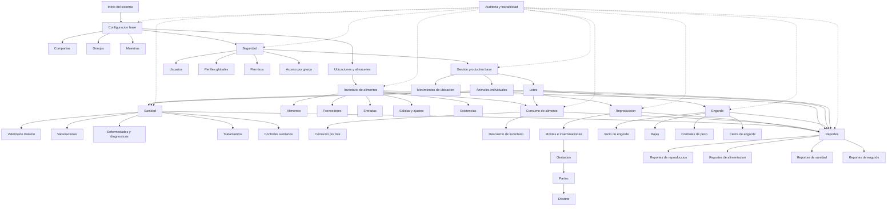
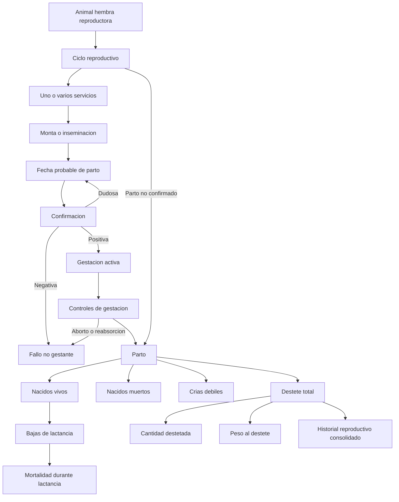
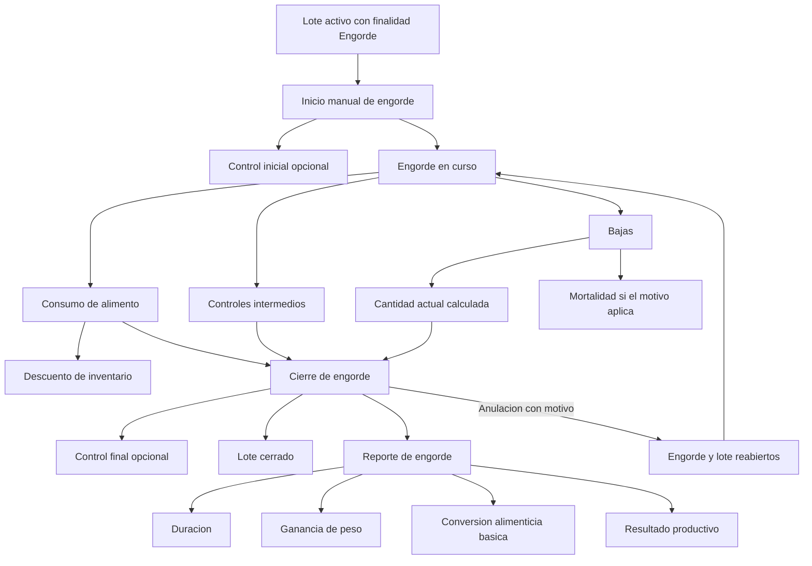
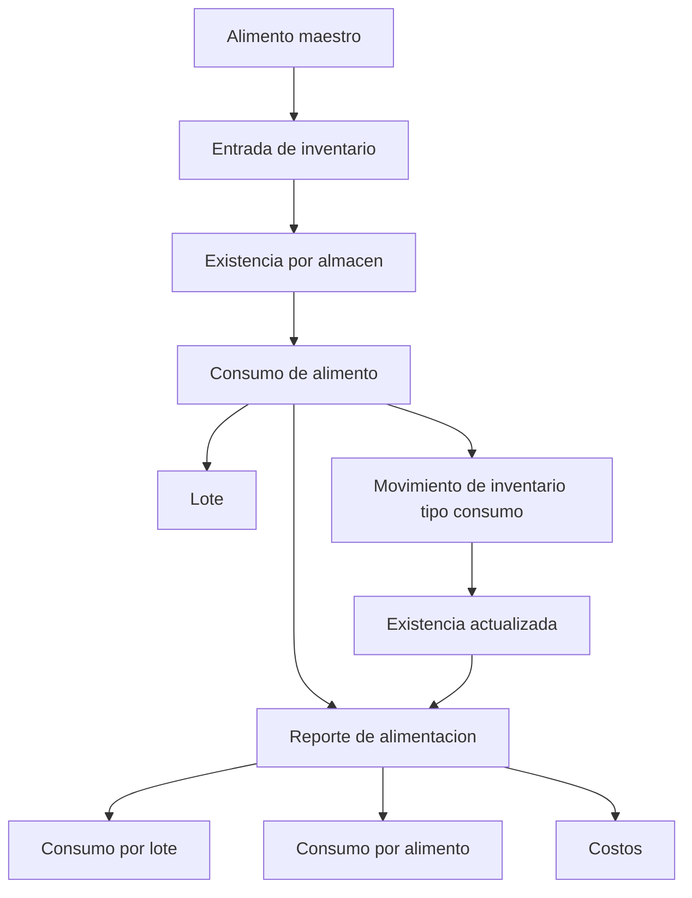
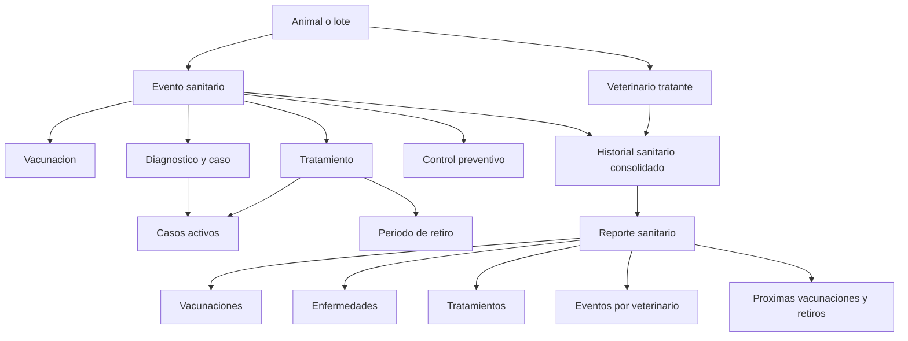

# Diagrama de Flujo General

Este documento resume visualmente el flujo funcional definido en las especificaciones SDD del proyecto.

Si usas un visor Mermaid que espera solo sintaxis Mermaid, abre `04-diagrama-flujo-general.mmd`. Este archivo `.md` esta pensado para previsualizacion Markdown.

## Flujo general del sistema

## Flujo reproductivo

## Flujo de engorde

## Flujo de alimentacion e inventario

## Flujo sanitario

## Reglas transversales

- Todo dato productivo pertenece a una granja.
- Toda granja pertenece a una compania.
- Todo acceso debe validar usuario, perfil, compania y granjas permitidas.
- Las maestras definen opciones reutilizables.
- Los eventos y movimientos registran hechos historicos con fecha.
- Los eventos importantes no se eliminan fisicamente; se anulan con auditoria.
- Los reportes excluyen anulados por defecto.
