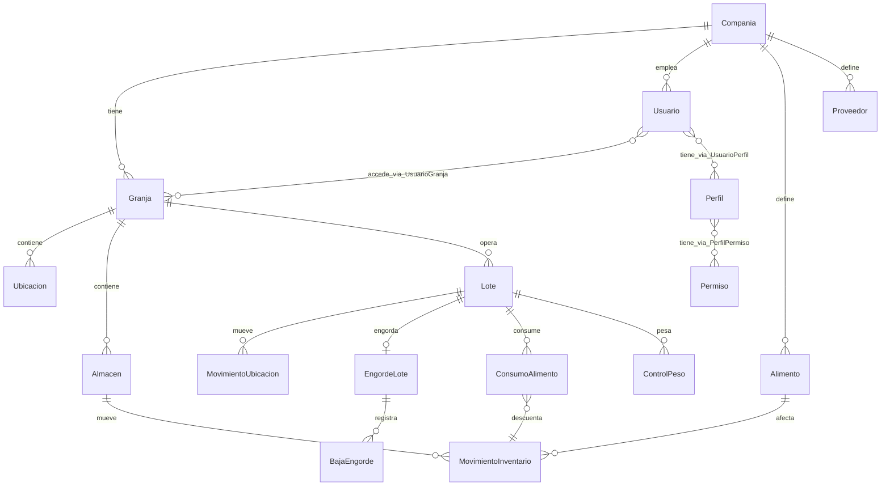

# Diseno Tecnico Inicial — MVP v1

Este documento traduce el SDD funcional cerrado en decisiones de implementacion concretas: arquitectura, modelo de datos, permisos, auditoria y estructura del proyecto.

## Referencias

- Cierre SDD: `06-cierre-sdd.md`
- MVP v1: `05-mvp-tecnico.md`
- Stack: `decisions/0006-stack-tecnologico.md`
- Convenciones: `08-convenciones-implementacion.md`
- Errores: `09-catalogo-errores.md`
- Cierre diseno: `10-cierre-diseno-tecnico.md`
- Guia UX/UI: `11-guia-ux-ui.md`
- Git y calidad: `12-convenciones-git-y-calidad.md`
- Modelo TypeORM: `src/database/entities/`

## Objetivo tecnico del MVP v1

Implementar el flujo:

```text
Compania -> Granja -> Lote -> Engorde -> Inventario -> Consumo -> Pesos -> Cierre -> Reportes
```

Con seguridad multi-compania, acceso por granja, auditoria transversal y UI mobile-first.

## Arquitectura

### Enfoque: monolito modular con capa de servicios

```text
┌─────────────────────────────────────────────────────┐
│  app/ (Next.js App Router)                          │
│  ├── (auth)/login                                   │
│  ├── (app)/dashboard, lotes, inventario, reportes   │
│  └── api/ (Route Handlers — fachada HTTP)           │
├─────────────────────────────────────────────────────┤
│  modules/ (logica de negocio por dominio)           │
│  ├── auth/  companias/  granjas/  lotes/            │
│  ├── inventario/  consumo/  engorde/  pesos/         │
│  └── reportes/                                      │
├─────────────────────────────────────────────────────┤
│  lib/ (infraestructura compartida)                  │
│  ├── db.ts  auth.ts  permissions.ts  audit.ts     │
│  └── errors.ts  validation/                         │
├─────────────────────────────────────────────────────┤
│  components/ (UI reutilizable mobile-first)         │
├─────────────────────────────────────────────────────┤
│  lib/ (db TypeORM, auth, permisos)                  │
├─────────────────────────────────────────────────────┤
│  src/database/ + PostgreSQL                         │
└─────────────────────────────────────────────────────┘
```

### Reglas arquitectonicas

1. **Sin logica de negocio en componentes React.** Los componentes renderizan y delegan.
2. **Los Route Handlers solo validan, autorizan y delegan** a servicios en `modules/`.
3. **Toda consulta productiva filtra** por `companiaId` y granjas permitidas del usuario.
4. **Las validaciones Zod viven en `modules/*/schemas.ts`** y se reutilizan en API y formularios.
5. **Los reportes son consultas de lectura** sobre eventos no anulados.

## TypeORM — convenciones

### Acceso a datos

- Configuracion central en `src/database/data-source.ts`.
- Entidades agrupadas por dominio en `src/database/entities/`.
- Los servicios obtienen repositorios via `getDataSource()`:

```typescript
const ds = await getDataSource();
const loteRepo = ds.getRepository(Lote);
```

### Migraciones

- `synchronize: false` siempre en produccion.
- Migraciones versionadas en `src/database/migrations/`.
- Generar con TypeORM CLI apuntando a `src/database/typeorm-cli.ts`.

### Transacciones

Operaciones que afectan multiples tablas (consumo + movimiento inventario, cierre engorde) deben ejecutarse dentro de `QueryRunner` o `manager.transaction()`.

### Enums

Los enums de dominio viven en `src/database/enums.ts` y se mapean con `@Column({ type: 'enum', enum: ... })`.

## Estructura de carpetas

```text
gestion-granjas/
├── src/database/
│   ├── data-source.ts
│   ├── typeorm-cli.ts
│   ├── entities/
│   ├── migrations/
│   └── seeds/
├── src/
│   ├── app/
│   │   ├── (auth)/
│   │   │   └── login/page.tsx
│   │   ├── (app)/
│   │   │   ├── layout.tsx          # shell mobile-first + selector granja
│   │   │   ├── dashboard/page.tsx
│   │   │   ├── configuracion/
│   │   │   ├── lotes/
│   │   │   ├── inventario/
│   │   │   ├── consumo/
│   │   │   ├── engorde/
│   │   │   ├── pesos/
│   │   │   └── reportes/
│   │   └── api/
│   │       ├── auth/[...nextauth]/route.ts
│   │       ├── lotes/route.ts
│   │       └── ...
│   ├── modules/
│   │   ├── auth/
│   │   │   ├── auth.service.ts
│   │   │   └── auth.schemas.ts
│   │   ├── lotes/
│   │   │   ├── lotes.service.ts
│   │   │   ├── lotes.schemas.ts
│   │   │   └── lotes.permissions.ts
│   │   └── ...
│   ├── lib/
│   │   ├── db.ts                   # getDataSource() TypeORM
│   │   ├── auth.ts
│   │   ├── permissions.ts
│   │   ├── audit.ts
│   │   ├── tenant.ts               # filtros compania/granja
│   │   └── errors.ts
│   └── components/
│       ├── ui/                     # shadcn/ui
│       ├── forms/
│       ├── layout/
│       └── data-display/
├── docs/
└── package.json
```

## Multi-tenancy

### Capas de aislamiento

| Capa | Implementacion |
|------|----------------|
| Compania | `Usuario.companiaId` — un usuario solo ve su tenant |
| Granja | `UsuarioGranja` — subconjunto de granjas permitidas |
| Permiso | `Perfil` + `Permiso` — acciones permitidas |

### Funcion central: contexto de sesion

Cada request autenticado construye un `TenantContext`:

```typescript
type TenantContext = {
  userId: string;
  companiaId: string;
  granjaIds: string[];          // granjas permitidas
  permisos: string[];           // union de permisos de perfiles activos
  granjaActivaId?: string;      // granja seleccionada en UI
};
```

### Reglas de filtrado

- Entidades por compania (`Alimento`, `Proveedor`, `Lote`): `WHERE companiaId = ctx.companiaId`.
- Entidades por granja (`Almacen`, `MovimientoInventario`, `ConsumoAlimento`): ademas `granjaId IN ctx.granjaIds`.
- Si hay `granjaActivaId`, las pantallas operativas filtran por esa granja.
- Nunca confiar en IDs enviados por el cliente sin validar pertenencia al tenant.

## Autenticacion

### MVP v1: Auth.js con Credentials Provider

| Aspecto | Decision |
|---------|----------|
| Identificador | Correo electronico (unico global) |
| Contrasena | Hash con bcrypt (cost factor 12) |
| Sesion | Cookie HTTP-only, estrategia JWT o database session |
| Recuperacion | No en v1 — admin restablece contrasena |
| Estados bloqueados | `INACTIVO` y `BLOQUEADO` no pueden iniciar sesion |

### Flujo de login

1. Usuario ingresa correo y contrasena.
2. Sistema valida credenciales y estado activo.
3. Sesion incluye `userId`, `companiaId`, `granjaIds`, `permisos`.
4. Si tiene una sola granja, se selecciona automaticamente.
5. Si tiene varias, muestra selector de granja activa.

### Extension futura (app movil)

Agregar endpoint `/api/auth/token` con JWT sin cambiar la logica de permisos en `modules/`.

## Convencion de permisos

### Formato

```text
<modulo>.<recurso>.<accion>
<modulo>.<accion>
```

Ejemplos: `lotes.crear`, `inventario.movimientos.crear`, `reportes.engorde.ver`.

### Implementacion

```typescript
// lib/permissions.ts
function requirePermission(ctx: TenantContext, codigo: string): void {
  if (!ctx.permisos.includes(codigo)) {
    throw new ForbiddenError(`Permiso requerido: ${codigo}`);
  }
}

function requireGranjaAccess(ctx: TenantContext, granjaId: string): void {
  if (!ctx.granjaIds.includes(granjaId)) {
    throw new ForbiddenError('Sin acceso a la granja');
  }
}
```

### Permisos MVP v1 activos

Solo se implementan permisos de modulos incluidos en MVP v1:

- `companias.*`, `granjas.*`, `maestras.administrar`
- `usuarios.*`, `perfiles.administrar`
- `lotes.*`
- `ubicaciones.movimientos.*`
- `inventario.*`
- `alimentacion.consumo.*`
- `engorde.*`
- `pesos.*`
- `reportes.alimentacion.ver`, `reportes.engorde.ver`

Los demas permisos se seedean pero quedan inactivos hasta MVP v2.

## Auditoria y anulacion

### Entidades ABM (maestras, catalogos)

Campos estandar en entidades TypeORM:

- `estadoRegistro`: `ACTIVO` | `INACTIVO`
- `createdAt`, `updatedAt`
- `createdById`, `updatedById`

### Eventos historicos (movimientos, consumos, pesos, bajas)

Campos estandar:

- `createdAt`, `createdById`
- `anulado`: boolean (default false)
- `anuladoAt`, `anuladoById`, `motivoAnulacion` (nullable)

### Reglas

- **No DELETE** en eventos productivos — solo anulacion logica.
- Reportes excluyen registros con `anulado = true` por defecto.
- Anular consumo revierte el movimiento de inventario asociado (movimiento compensatorio o anulacion del movimiento origen).

## Modelo de datos — MVP v1

### Diagrama entidad-relacion (simplificado)



### Entidades por grupo

#### Organizacion y seguridad

| Entidad | Alcance | Notas |
|---------|---------|-------|
| `Compania` | Global | Tenant raiz |
| `Granja` | Compania | Unidad productiva |
| `Usuario` | Compania | Login con Auth.js |
| `Perfil` | Global | Roles del sistema |
| `Permiso` | Global | Catalogo seed |
| `UsuarioGranja` | — | N:M acceso por granja |
| `UsuarioPerfil` | — | N:M perfiles del usuario |

#### Maestras MVP v1

| Entidad | Alcance | Ejemplos |
|---------|---------|----------|
| `TipoAnimal` | Compania | Cerdo, Ave |
| `Raza` | Compania | Yorkshire, Duroc |
| `FinalidadProductiva` | Compania | Engorde, Reproduccion |
| `TipoUbicacion` | Compania | Galpon, Corral |
| `Ubicacion` | Granja | Galpon A, Corral 01 |
| `UnidadMedida` | Global (seed) | kg, g, saco |
| `TipoAlimento` | Compania | Iniciador, Engorde |
| `PresentacionAlimento` | Compania | Saco, Granel |
| `TipoMovimientoInventario` | Global (seed) | Compra, Salida, Ajuste |
| `MotivoMovimientoUbicacion` | Compania | Cambio a engorde |
| `MotivoCierreEngorde` | Compania | Venta, Sacrificio |
| `MotivoBajaEngorde` | Compania | Muerte, Descarte |
| `MetodoPesaje` | Compania | Bascula corral |
| `TipoControlPeso` | Global (seed) | Promedio, Muestra |

#### Operacion productiva

| Entidad | Tipo | Notas |
|---------|------|-------|
| `Lote` | ABM + operativo | Estados: ACTIVO, CERRADO, CANCELADO |
| `MovimientoUbicacion` | Evento | Solo lotes en v1 |
| `Alimento` | ABM | Con factor conversion presentacion |
| `Proveedor` | ABM | Por compania |
| `Almacen` | ABM | Por granja |
| `MovimientoInventario` | Evento | Existencia = SUM movimientos no anulados |
| `ConsumoAlimento` | Evento | Solo lote en v1; genera salida inventario |
| `EngordeLote` | Proceso | EN_CURSO → CERRADO |
| `BajaEngorde` | Evento | Reduce cantidad del lote |
| `ControlPeso` | Evento | Promedio por animal en lotes |

### Campos clave por entidad operativa

#### Lote

```text
codigo (unique por granja)
companiaId, granjaId
tipoAnimalId, finalidadProductivaId
fechaInicio, cantidadInicial
ubicacionId (actual, denormalizado)
estadoOperativo: ACTIVO | CERRADO | CANCELADO
estadoRegistro + auditoria ABM
```

**Cantidad actual (calculada):** `cantidadInicial - SUM(bajas no anuladas del engorde activo)`.

#### EngordeLote

```text
loteId (unique si EN_CURSO)
fechaInicio, cantidadInicial, pesoInicialPromedio
fechaCierre, cantidadFinal, pesoFinalPromedio
motivoCierreId
estado: EN_CURSO | CERRADO | ANULADO
```

#### MovimientoInventario

```text
tipoMovimientoId (determina signo: + o -)
almacenId, alimentoId
cantidad, unidadMedidaId
costoUnitario, costoTotal (manual v1)
proveedorId (opcional, entradas)
referencia, observaciones
anulado + auditoria evento
```

**Existencia:** calculada en consulta:

```sql
SUM(CASE WHEN tipo.esEntrada THEN cantidad ELSE -cantidad END)
WHERE anulado = false
GROUP BY almacenId, alimentoId
```

#### ConsumoAlimento

```text
loteId (v1)
fecha, alimentoId, almacenId
cantidad, unidadMedidaId
movimientoInventarioId (salida generada)
anulado + auditoria evento
```

## Validacion con Zod

Cada modulo expone schemas en `*.schemas.ts`:

```typescript
// modules/lotes/lotes.schemas.ts
export const crearLoteSchema = z.object({
  granjaId: z.string().uuid(),
  codigo: z.string().min(1).max(50),
  tipoAnimalId: z.string().uuid(),
  finalidadProductivaId: z.string().uuid(),
  fechaInicio: z.coerce.date(),
  cantidadInicial: z.number().int().positive(),
  ubicacionId: z.string().uuid().optional(),
  observaciones: z.string().max(500).optional(),
});
```

Los servicios reciben datos ya validados. Los Route Handlers parsean con `safeParse` y devuelven 400 con errores de campo.

## API — convenciones

### Formato de respuesta

```typescript
// Exito
{ data: T }

// Error
{ error: { code: string; message: string; details?: unknown } }
```

### Codigos HTTP

| Codigo | Uso |
|--------|-----|
| 200 | Consulta exitosa |
| 201 | Creacion exitosa |
| 400 | Validacion fallida |
| 401 | No autenticado |
| 403 | Sin permiso o sin acceso a granja |
| 404 | Recurso no encontrado en tenant |
| 409 | Conflicto de negocio (duplicado, stock insuficiente) |

### Endpoints MVP v1 (inicial)

| Metodo | Ruta | Modulo |
|--------|------|--------|
| POST | `/api/auth/[...nextauth]` | Auth |
| GET/POST | `/api/companias` | Config |
| GET/POST | `/api/granjas` | Config |
| GET/POST | `/api/usuarios` | Seguridad |
| GET/POST | `/api/lotes` | Lotes |
| POST | `/api/lotes/[id]/movimientos-ubicacion` | Ubicaciones |
| GET/POST | `/api/alimentos` | Inventario |
| GET/POST | `/api/almacenes` | Inventario |
| GET/POST | `/api/inventario/movimientos` | Inventario |
| GET | `/api/inventario/existencias` | Inventario |
| GET/POST | `/api/consumo` | Consumo |
| POST | `/api/consumo/[id]/anular` | Consumo |
| POST | `/api/engorde/iniciar` | Engorde |
| POST | `/api/engorde/[id]/bajas` | Engorde |
| POST | `/api/engorde/[id]/cerrar` | Engorde |
| GET/POST | `/api/pesos` | Pesos |
| GET | `/api/reportes/existencias` | Reportes |
| GET | `/api/reportes/consumo` | Reportes |
| GET | `/api/reportes/engorde` | Reportes |

## UI mobile-first

### Layout

- **Bottom navigation** en movil: Dashboard, Lotes, Inventario, Consumo, Mas.
- **Sidebar** en tablet/desktop (breakpoint `md:`).
- **Selector de granja** persistente en header cuando el usuario tiene multiples granjas.

### Patrones de pantalla

| Tipo | Patron |
|------|--------|
| Listado | Cards apiladas en movil; tabla en desktop |
| Formulario | Campos full-width, labels arriba, boton fijo abajo |
| Detalle | Secciones colapsables con historial |
| Reportes | Totales destacados + lista detalle |

### Breakpoints Tailwind

- Base (< 768px): diseno movil.
- `md:` (768px+): sidebar + tablas.
- `lg:` (1024px+): columnas multiples en dashboard.

## Reglas de negocio criticas (servicios)

Implementar como funciones puras testeables en `modules/*/rules.ts`:

1. **Stock no negativo:** rechazar salida/ajuste negativo/consumo si existencia resultante < 0.
2. **Lote unico por codigo** dentro de la granja.
3. **Un engorde EN_CURSO por lote** a la vez.
4. **No eventos en lote CERRADO o CANCELADO.**
5. **Consumo siempre genera movimiento de salida** en el almacen indicado.
6. **Anular consumo anula movimiento** de inventario vinculado.
7. **Movimiento ubicacion actualiza** `Lote.ubicacionId`.
8. **Anular ultimo movimiento ubicacion recalcula** ubicacion anterior.

## Seed inicial

El script `src/database/seeds/run-seed.ts` debe crear:

1. Permisos del catalogo completo.
2. Perfil `Administrador Sistema` con todos los permisos.
3. Perfil `Operador Granja` con permisos MVP operativos.
4. Unidades de medida base (kg, g, saco).
5. Tipos de movimiento de inventario.
6. Tipos de control de peso.
7. Compania y granja demo.
8. Usuario admin demo.

## Orden de implementacion

Alineado con `05-mvp-tecnico.md`:

| Sprint | Entregable |
|--------|------------|
| 1 | Proyecto Next.js + TypeORM + Auth.js + login |
| 2 | Compania, granja, usuarios, perfiles, permisos |
| 3 | Maestras base + ABM generico |
| 4 | Lotes + movimientos de ubicacion |
| 5 | Inventario (alimentos, almacenes, movimientos, existencias) |
| 6 | Consumo por lote con descuento de inventario |
| 7 | Engorde (inicio, bajas, cierre) |
| 8 | Controles de peso |
| 9 | Reportes basicos |
| 10 | Pulido mobile, pruebas E2E criticas |

## Criterios de listo para comenzar codigo

- [x] Stack definido
- [x] Modelo de datos MVP v1 definido
- [x] Convencion de permisos definida
- [x] Estrategia de auditoria definida
- [x] Estructura de proyecto definida
- [x] Entidades TypeORM MVP v1 creadas
- [x] Convenciones de implementacion documentadas
- [x] Catalogo de errores documentado
- [x] Diseno tecnico cerrado (`10-cierre-diseno-tecnico.md`)
- [ ] Proyecto Next.js scaffolded
- [ ] Base de datos configurada
- [ ] Migracion inicial generada y aplicada
- [ ] Seed ejecutado

## Siguiente paso

Diseno tecnico cerrado. Proceder con scaffold: Next.js + TypeORM + PostgreSQL + migracion inicial + seed.
